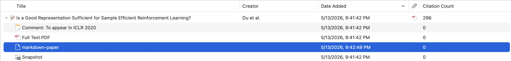

# Paper Markdown

Paper Markdown is a Zotero plugin that converts paper PDF attachments into Markdown files with the MinerU Precision Extract API. The generated Markdown is saved back into Zotero as a stored child attachment under the same paper item.



In the example above, `markdown-paper` is a Markdown attachment generated from the paper's full-text PDF. It remains attached to the original Zotero item, so it can be searched, opened, exported, or consumed by external reading and note-taking tools alongside the source PDF.

## Why This Matters

Zotero is already a strong reference manager: it stores bibliographic metadata, PDF attachments, collections, tags, notes, and citation data. Paper Markdown extends that library into a more usable knowledge base for AI-assisted research workflows.

Many AI agents and coding assistants, including Codex and Claude Code, work best with plain-text, structured files. Raw PDFs are harder for agents to inspect reliably: text extraction can lose section structure, formulas, tables, reading order, and references. By attaching a MinerU-generated Markdown version next to each Zotero PDF, the same curated Zotero library can become a local paper database that agents can search, read, quote from, summarize, compare, and cite more accurately.

This is especially useful when combined with skills, MCP servers, or local research automation. A typical agent workflow can use Zotero as the source of truth for paper metadata and attachments, then read the Markdown attachment as the high-quality text representation of the paper. In that setup, Zotero remains the user's managed literature library, while the generated Markdown provides an agent-friendly layer for literature review, note generation, citation auditing, and research synthesis.

## Research Basis: Why Markdown First

Paper Markdown is built around a Markdown-first reading workflow because current document AI research consistently treats PDF reading as a document parsing and representation problem, not just as "send the PDF to a model."

- End-to-end document reading systems need to handle raw files with complex layouts, formatting, long content, and multi-modal information. [DocBench](https://aclanthology.org/2025.knowledgenlp-1.29/) was introduced to evaluate exactly that full document-reading workflow rather than only plain text question answering.
- Direct visual reading of long PDFs remains difficult. [MMLongBench-Doc](https://proceedings.neurips.cc/paper_files/paper/2024/hash/ae0e43289bffea0c1fa34633fc608e92-Abstract-Datasets_and_Benchmarks_Track.html) evaluates 135 PDF-formatted documents averaging 47.5 pages and 21,214 tokens; the best reported model, GPT-4o, reached 44.9 F1, and most evaluated LVLMs performed worse than LLMs reading lossy OCR text.
- Downstream RAG quality depends heavily on document preprocessing. [From PDF to RAG-Ready](https://arxiv.org/abs/2604.04948) compared PDF-to-Markdown conversion pipelines across 19 configurations and found a wide gap between naive PDF loading, automated structured conversion, and manually curated Markdown. Its best automated setup reached 94.1% QA accuracy, while manually curated Markdown reached 97.1%.
- Document parsing surveys frame the goal as turning unstructured or semi-structured documents into machine-readable representations for applications such as knowledge-base construction and RAG. [Document Parsing Unveiled](https://arxiv.org/abs/2410.21169) highlights that robust parsing has to recover layout, text, tables, mathematical expressions, and visual elements.
- Scientific PDFs are especially challenging because important semantics are embedded in formulas, tables, and layout. [Nougat](https://arxiv.org/abs/2308.13418) motivates academic PDF-to-markup conversion by noting that PDF storage loses semantic information, especially for mathematical expressions.
- MinerU is a practical extraction backend for this problem class. Its technical report, [MinerU: An Open-Source Solution for Precise Document Content Extraction](https://arxiv.org/abs/2409.18839), focuses on high-precision extraction across OCR, layout detection, formula recognition, and diverse document types.

The practical conclusion is that PDF should remain the source artifact, but Markdown should be the default working representation for AI-assisted reading. A Markdown attachment gives agents stable text, headings, formula text, table text, page-derived structure, and local file access for search, chunking, embeddings, review, and citation workflows. When visual fidelity matters, such as for figures, dense tables, ambiguous formulas, or suspected extraction errors, the original Zotero PDF remains attached as the ground-truth fallback.

## End-to-End Reading Benchmark

On May 15, 2026, a local Codex workflow compared a Zotero Markdown database path against online paper-discovery and online PDF-reading paths. The test paper was [Deep Reinforcement Learning from Human Preferences](https://papers.nips.cc/paper/7017-deep-reinforcement-learning-from-human-preferences), which is also available as [arXiv:1706.03741](https://arxiv.org/abs/1706.03741). The local Zotero library already contained the paper's PDF attachment and a Paper Markdown attachment generated from the PDF.

Timings below are single-run wall-clock measurements from that local environment. They should be read as workflow-scale evidence, not as a stable benchmark of remote services: online search and download times vary, API results can change, and local cache state matters.

Accuracy was checked with nine paper-specific probes: exact title and authors, the feedback-cost claim, Atari and MuJoCo domains, trajectory-segment preference setup, reward-model training flow, human-time claim, method-section coverage, preference-model formula/loss coverage, and references or appendix coverage. Passing all probes means the route recovered the main paper content for ordinary agent reading; it does not guarantee visual or formula-perfect extraction.

| Route | What was measured | Time | Probe result | Practical result |
| --- | --- | ---: | --- | --- |
| Local Zotero Markdown database via an external `zotero-paper-library` helper | Exact-title lookup in Zotero metadata, then read the stored Markdown attachment | 1.30 s | 9/9 | Best default when the paper is already curated locally: no network lookup, structured Markdown, 19 Markdown headings, and immediate access to the user's managed source item. |
| Same local Markdown attachment after its Zotero attachment key is known | Read stored Markdown directly through Zotero's local API | 1.28 s | 9/9 | Same text quality as exact-title lookup; useful for follow-up reads after a search result has already identified the attachment. |
| Direct local Markdown file after the path is known | Read the stored `.md` file from disk | 0.01 s | 9/9 | Lower-bound read time, but not a discovery workflow by itself because another layer must already know the file path. |
| Online academic search through Crossref and OpenAlex | Search title across online metadata sources | 4.99 s | Metadata only | Found the exact OpenAlex record, but only at rank 6; higher-ranked Crossref results were false positives. This is useful for discovery, not full reading. |
| Online Semantic Scholar title search | Search title through the configured online connector | 9.49 s | No result | Returned no matching record in this run, showing the fragility of title-only online search. |
| Online arXiv title search through the configured connector | Search title before reading | 11.31 s via MCP with no result; CLI run exceeded 60 s and was aborted | No result | The paper exists on arXiv, but this connector path did not reliably recover it from the natural-language title in this run. |
| Online arXiv read with known ID `1706.03741` | Download PDF and extract text through the paper-search arXiv reader | 4.66 s | 9/9 | Full plain text was recovered, but the result had no Markdown heading structure and mathematical notation was degraded. |
| Online Semantic Scholar read with known ID `ARXIV:1706.03741` | Resolve metadata, download PDF, and extract text | 6.68 s | 9/9 | Returned useful metadata and page-marked plain text, but had the same PDF-text extraction limitations for formulas and structure. |
| Online NeurIPS official PDF plus PyPDF extraction | Download the official NeurIPS PDF and extract text locally | 10.60 s | 9/9 | Recovered the main text from the official source, but as unstructured plain text with degraded formulas. |
| Online arXiv PDF plus PyPDF extraction | Download the arXiv PDF and extract text locally | 3.88 s | 9/9 | Fast when the exact PDF URL is already known, but still produces plain text rather than Markdown. |
| Online NeurIPS PDF plus fresh MinerU parsing | Parse the online official PDF into Markdown | 37.26 s | 9/9 | Highest-quality online reparse in this test: Markdown structure and the preference-model equation were cleaner than generic PDF text extraction. It is much slower and depends on an external parsing service. |

The qualitative difference matters more than the raw seconds. Online search first has to discover the correct paper, and that step can return false positives, miss the target paper, rank it below unrelated records, or expose only an abstract page. In this test, the NeurIPS abstract page was useful for metadata but not a full-text substitute, and its abstract wording differed from the PDF wording on the feedback percentage. Online full-text reading became reliable only after a correct arXiv ID or direct PDF URL was already known.

The local Zotero Markdown database path removes that discovery uncertainty for papers the user has already saved and converted. It gives an agent a stable local source item, a reusable Markdown representation, and the original PDF fallback under the same Zotero item. The stored Markdown is still an extraction artifact: in this paper, the local Markdown preserved the main content and structure but had minor formula/citation artifacts around the preference-model equation and the Ng and Russell citation. For formula-sensitive reading, the original PDF or a fresh high-quality parse remains the ground truth. For ordinary literature review, summarization, comparison, and citation-context retrieval, the measured workflow supports a simple rule: discover and convert a paper once, keep PDF plus Markdown in Zotero, then read from the local Markdown database by default.

## Agent Integrations Coming Soon

Paper Markdown is designed to provide the document layer for agentic research workflows. Related skills, MCP servers, and agent plugins are planned so tools such as Codex, Claude Code, Obsidian workflows, local RAG systems, and citation-audit agents can discover Zotero items, locate their generated Markdown attachments, and use them as structured paper context.

Contributions are welcome. Useful integration directions include:

- Codex or Claude skills for searching a Zotero library and reading generated Markdown attachments.
- MCP servers that expose Zotero paper metadata, PDF attachments, Markdown attachments, and conversion status to AI agents.
- Agent plugins for literature review, paper comparison, note generation, citation checking, and research synthesis.
- Indexing and RAG adapters that treat Zotero as the source of truth while using Paper Markdown attachments as the retrieval corpus.

The plugin intentionally saves Markdown back into Zotero as ordinary child attachments, so external tools do not need a private database format to build on top of it.

## Features

- Convert a single Zotero PDF attachment to Markdown from the item context menu.
- Save generated Markdown files as Zotero stored child attachments.
- Use MinerU's signed batch upload flow for PDF extraction.
- Configure extraction model, language, page ranges, OCR, formula recognition, and table recognition.
- Use Zotero's rename template or a plugin-level filename template for Markdown output.
- Choose how existing Markdown attachments are handled: skip, version, or overwrite.
- Preview and run batch conversion across all libraries, the current collection, or selected items.
- Track queue progress, failed tasks, retries, and runtime logs in the Paper Markdown panel.
- Automatically convert newly added PDF attachments when enabled.
- Preview and clean up generated Markdown attachments without touching source PDFs.
- Test MinerU API connectivity without uploading a PDF.

## How It Works

Paper Markdown reads local Zotero PDF attachments, sends them to MinerU for extraction, downloads the result archive, selects the Markdown output, and stores that Markdown file back in Zotero.

```text
Zotero PDF attachment
  -> request MinerU signed upload URLs
  -> upload PDF to MinerU
  -> poll MinerU extraction result
  -> download result archive
  -> select and rename Markdown output
  -> create Zotero stored Markdown attachment
```

The plugin does not store converted files in an external library directory by default. Zotero remains the source of truth for the generated Markdown attachment.

## Requirements

- Zotero `8.999` or later, compatible with Zotero `9.*`
- A valid MinerU API token
- Local Zotero PDF attachments available on disk

## Installation

1. Download the latest `.xpi` file from [Releases](https://github.com/YangJay2004/zotero-paper-markdown/releases).
2. Open Zotero.
3. Go to `Tools -> Plugins`.
4. Choose `Install Add-on From File...`.
5. Select the downloaded `paper-markdown-*.xpi`.
6. Restart Zotero if prompted.

## Configuration

Open Zotero settings and select the `Paper Markdown` pane.

### MinerU API

| Setting | Description |
| --- | --- |
| `API Token` | MinerU API token used for extraction requests. |
| `Test MinerU API` | Checks token validity and API reachability without uploading a PDF. |

The token is stored only in local Zotero preferences. It is not bundled into the plugin package.

### Extraction

| Setting | Default | Description |
| --- | --- | --- |
| `Model` | `vlm` | MinerU extraction model. `pipeline` is also available. |
| `Language` | `ch` | Document language. Use `en` for English papers. |
| `Page ranges` | empty | Optional page selection, such as `1-20,25`. Empty means all pages. |
| `MinerU batch size` | `10` | Number of PDFs submitted in one MinerU batch. |
| `Upload concurrency` | `4` | Number of prepared PDF files uploaded in parallel. |
| `Enable OCR` | off | Use for scanned PDFs or low-quality text layers. |
| `Enable formula` | on | Enables formula recognition. |
| `Enable table` | on | Enables table recognition. |

### Output

| Setting | Default | Description |
| --- | --- | --- |
| `Existing Markdown` | `Skip` | Controls what happens when Markdown already exists for the same paper. |
| `Use Zotero rename template` | on | Uses Zotero's file-renaming rules for generated Markdown names. |
| `Markdown filename template` | title/creator/year template | Plugin-level fallback naming template. |
| `Keep raw MinerU zip` | off | Keeps MinerU's raw result archive for inspection. |
| `Conservatively normalize Markdown heading levels` | off | Adjusts heading levels when extraction output is structurally inconsistent. |
| `Auto convert newly added PDFs` | off | Queues new PDF attachments for conversion automatically. |

For `Existing Markdown`, the available policies are:

- `Skip`: leave the existing Markdown in place and skip conversion.
- `Create new version`: keep the existing Markdown and create a new attachment.
- `Overwrite`: replace an existing Paper Markdown generated attachment.

## Usage

### Convert One Paper

1. Select a Zotero item with a local PDF attachment, or select the PDF attachment directly.
2. Right-click and choose `Convert to Markdown with MinerU`.
3. Wait for the task to finish.
4. Open the generated Markdown child attachment under the same Zotero item.

### Batch Convert PDFs

1. Open `Tools -> Open Paper Markdown Panel`.
2. Choose a scope: all libraries, current collection, or selected items.
3. Click `Preview` to inspect what will be converted.
4. Click `Start Queue` to begin conversion.
5. Use `Retry Failed` for failed tasks if needed.
6. Use `Stop After Current` to stop after the active MinerU batch finishes.

The preview step reports how many PDFs are available, already converted, unavailable, and queued under the current settings.

### Clean Up Markdown Attachments

The Paper Markdown panel also includes Markdown management tools. Cleanup always starts with a preview and does not remove source PDF attachments.

Supported cleanup targets include:

- Paper Markdown generated attachments
- All Markdown-like attachments

## Privacy

PDF files are uploaded to MinerU only when a conversion task starts. The API connectivity test does not upload PDFs.

Use this plugin only for documents you are allowed to upload to MinerU. The plugin does not print the API token in logs and does not include the token in the XPI package.

## Build From Source

The release package is a Zotero `.xpi` archive. To build it locally:

```bash
./scripts/build-xpi.sh
```

The generated package is written to `dist/`.

## Compatibility

The plugin manifest currently declares:

```json
{
  "strict_min_version": "8.999",
  "strict_max_version": "9.*"
}
```

The published add-on ID is:

```text
zotero-paper-markdown@yangjay2004.github.io
```
